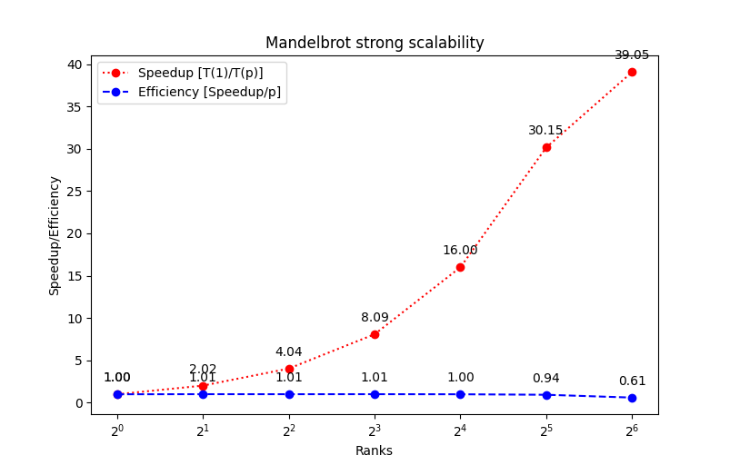

# Parallel Computing

**Group 66**

*Benjamin Zvolenszki / s1124537*

*Luuk Derks / s1038637*

## Assignment 2 - MPI

I've put all work on Github: https://github.com/bzvol/pc-mpi-assigment

*Please note that I wrote this document in markdown, and my md-pdf converter usually puts images elsewhere in the doc where they were originally placed in the markdown file.*

I'll start with our work distribution.

### Task 5

First, we unfortunately couldn't do the first assignment, therefore we started from zero knowledge.

Initially we thought that I would do the parallelization and evaluation part, then Luuk will do the writing/report. However, at the end, Luuk didn't have enough time to read my code and write the report, so I decided to finish this. Luuk agreed to do the next assignment.

### Task 0: specs

The used partition(s) have the following properties:

- **CPU**: Intel Xeon E-2378 @ 2.60GHz, 8 cores/16 threads
- **RAM**: 32GB
- **GCC**: gcc (Ubuntu 11.3.0-1ubuntu1~22.04) 11.3.0

Used parameters for computation:

- **M x N**: $5000 \times 5000$ ($2.5 \cdot 10^7$ pixels), except for weak scalability measurement, where it was $(P\cdot500) \times 1000$ ($\frac{1}{2}P \cdot 10^6$ pixels) (where P is the number of processes).
- **Max iterations**: 100
- **Computed subset**: $[-2, 2] \times [-2, 2]$

The code was run 10 times for each measurement (and for each node count), except for the first (Figure 1) where it was run 20 times.

I used 1, 2, 4, 8 nodes for each measurement.

### Task (1-)2: parallelization & load balancing

#### Distribution

I had bit of a journey with finding out why do I need to care about the distribution. I spent one whole day with implementing the block distribution (each process got some consecutive rows of the picture to compute, but not fully equally distributed). Somewhy I thought to make the evaluation graphs before looking at the load balance. So at the end, after finding out that **the current load balance is around 25-30 for 8 nodes/64 ntasks**, I started everything over.

Also on this day I needed to read about strong/weak scalability and how to measure them for my code.

I realized why I need to implement cyclic distribution. *I also saw that block-cyclic distribution is better for tasks where there is a lot of communication between processes and the computation depends on other processes' results, which was not the case for this task.*

With cyclic distribution, the processes compute rows `[rank, rank + size, rank + 2*size, ... while (rank + k*size) is less than M]`.

#### Printing the picture, collecting rows

I first tried to use `MPI_Gatherv` to collect the local rows to the complete picture, as I did with block distribution. It seemed that this is not possible with one call of `MPI_Gatherv`.

Then I tried to use the non-blocking `MPI_Isend` to send each row individually to node 0, and the blocking `MPI_Recv` to receive them individually. This worked, but only for small images, with about max. 1000x1000 resolution. Above that it resulted in segmentation fault.

Then I realized that actually `MPI_Gather(v)` is not a method that collects data from every process at the same time, but it justs sends a buffer from the calling process to a given buffer. So I replaced `MPI_Isend` and `MPI_Recv` with just `MPI_Gather`, still for each row individually. This works for all image sizes.

**With cyclic distribution, the load balance has improved to ~1**.

I don't know about my code's memory scalability. I assume the change from block to cyclic distribution didn't affect it.

### Task 3: evaluation

#### Benchmark (Gflops/s)

#### Strong scalability

#### Weak scalability

The values above the points also show what image resolution was used for the given number of processes at the computation.

Based on the graphs, I still cannot assume that my code is strongly and/or weakly scalable, but the stats have dramatically improved compared to the block distribution (whose graphs I lost).
